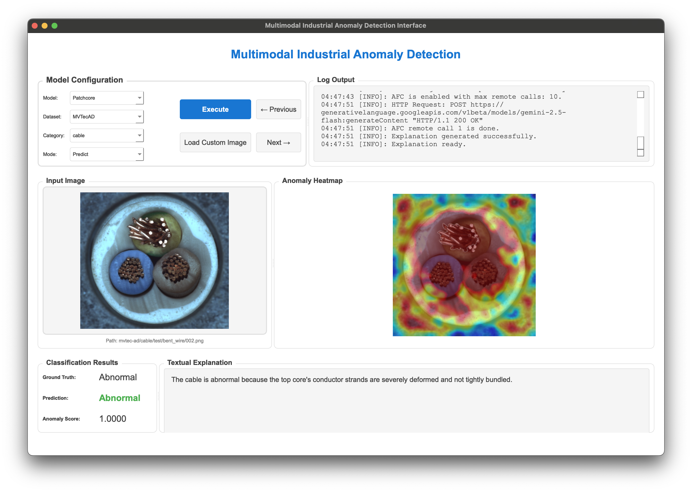

# Multimodal Industrial Anomaly Detection Interface

A multimodal system that generates **dynamic textual explanations** of image anomalies using **large language models (LLMs)**, making it well-suited for the open-ended nature of anomalies making them difficult to predefine.

## Core Features:
- Extending [anomalib](https://github.com/open-edge-platform/anomalib) by proving a multimodal GUI.
- Textual anomaly explanation via multimodal LLMs.
- Multimodal PatchCore implementation (currently RGB and Depth sources are supported, but more can be added).





## Project Overview
This project provides a graphical user interface (GUI) for Image Anomaly Detection (IAD). It is designed for quality inspection systems but is also useful for analyzing IAD algorithms.

The system offers:
- A user-friendly GUI to view an input image, the resulting anomaly map, and a textual explanation of the anomaly.
- **Visual** (pixel-level) and **textual** (LLM-based) explanations for anomaly detection results. The explanations are generated dynamically based on, i.e., the input image and the anomaly map.
- Support for various datasets (e.g., MVTec 2D and 3D, LOCO).
- The core of the IAD is based on the `anomalib` library, utilizing the PatchCore model and an extension of it for multimodal inputs. Textual explanations are generated via Google's Gemini models.
- Text-to-speech (TTS) of the explanations.

Based on:
- **anomalib** (≥2.0.0): Advanced anomaly detection library
- **PyQt6**: GUI framework
- **pyttsx3**: Text-to-speech library
- **google-genai**: Google Gemini API client
- **Development tools**:
  - ruff (≥0.12.0): Python linter


## Getting Started

### Prerequisites

- Python 3.10 or higher
- uv package manager (pip is also possible)

### Installation
```bash
git clone https://github.com/ClemensKubach/multimodal-iad.git
cd multimodal-iad
```

Setting the environment variable `GIT_LFS_SKIP_SMUDGE=1` is necessary because of an anomalib install bug.
Install application and dependencies:
```bash
GIT_LFS_SKIP_SMUDGE=1 uv sync
```

### Usage
Set the environment variable `GEMINI_API_KEY` to your Google Gemini API key (i.e. via .env file).

Run the GUI application:
```bash
uv run multimodal-iad
```

## Development
Note that currently anomalib f1_adaptive_threshold is not working as expected (Index out of bounds error).
Locally, there is a quickfix in the code, but the underlying issue should be fixed in anomalib.
Maybe, fork it later.


## Known Issues
- Anomalib bug in f1_adaptive_threshold
- Status bar not always showing
